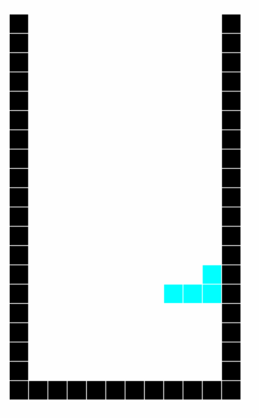

## 📱 TETRIS with ES2015

Total 304 lines

```
$ wc assets/javascripts/**                                                               [17:58:56]
       3      10      99 assets/javascripts/app.js
     301    1012    6596 assets/javascripts/tetris.js
     304    1022    6695 total
```



## Usage

* 🙈 module bundler [Parcel](https://github.com/parcel-bundler/parcel)
* 🙉 Javascript     [ES2015](http://www.ecma-international.org/ecma-262/6.0/index.html)/[PixiJS](https://github.com/pixijs/pixi.js)
* 🙊 CSS            [Sass](http://sass-lang.com/)/[Autoprefixer](https://github.com/postcss/autoprefixer)

```
npm i
npm run dev
```

## License
This content is released under the [MIT](http://opensource.org/licenses/MIT) License.
